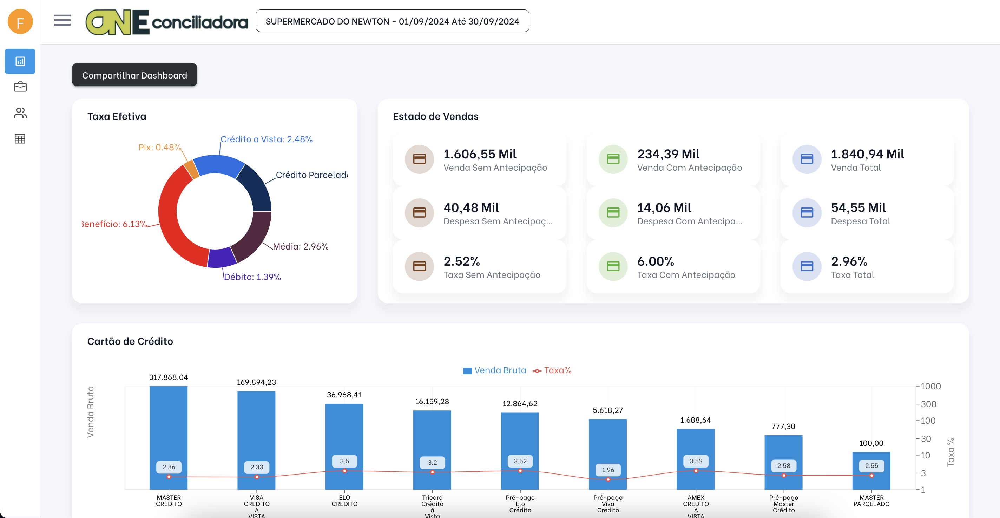

# Dashboard Gerencial para Conciliação de Cartões

## Pré-Requisitos

- Python 3.12
- PostgreSQL
- Composer

## Visão Geral

O **Sistema de Dashboard para Conciliação de Cartões** é uma ferramenta robusta desenvolvida para auxiliar lojistas e clientes na análise e gestão de pagamentos realizados por operadoras de cartão de crédito (adquirentes). Com um design intuitivo e uma infraestrutura tecnológica sólida, o sistema oferece uma visão clara e precisa sobre as taxas cobradas, antecipações e resultados financeiros.

## 🖥 Arquitetura Tecnológica
- Frontend: Desenvolvido em React, proporcionando uma interface dinâmica e responsiva para os usuários.
- Backend: Construído em Django com Python, garantindo uma base robusta e escalável.
- Banco de Dados: Utiliza PostgreSQL para armazenamento e gerenciamento eficiente das informações.
## 📋 Funcionalidades Principais
**🔍 Consulta e Importação de Dados**
- Integração com Adquirentes: Busca automática dos dados de pagamentos efetuados pelas operadoras de cartão ao cliente.
- Organização Centralizada: Consolidação dos pagamentos e taxas para análise detalhada.
##📊 Dashboard Gerencial
- Visualização de Taxas:
    - Taxas aplicadas por operadora de cartão.
    - Custos de antecipação de recebíveis.
- Resumo Gerencial: Apresentação de resultados finais das operações financeiras em formato visual, intuitivo e fácil de interpretar.
- Insights Personalizados: Identificação de tendências e oportunidades para otimizar custos com adquirentes.
## 📑 Próximos Desenvolvimentos
- Cross Check Avançado: Comparação entre:
    - Dados de vendas processadas.
    - Extratos bancários.
    - Taxas contratadas e valores efetivamente depositados.
- Validação Completa: Identificação de divergências, como vendas não pagas ou taxas aplicadas incorretamente.
## 🚀 Benefícios
- Transparência Financeira: Proporciona uma visão clara e detalhada dos pagamentos recebidos e taxas cobradas.
- Otimização de Custos: Identifica adquirentes e operações com maior impacto financeiro, ajudando o cliente a negociar melhores condições.
- Conformidade e Controle: Garante que as vendas e taxas estão em conformidade com os contratos estabelecidos.
## 🛠 Tecnologias Utilizadas
- Frontend: Reactjs
- Backend: Django + Python.
- Banco de Dados: PostgreSQL.
- Outras Integrações: API das adquirentes para coleta de dados.
